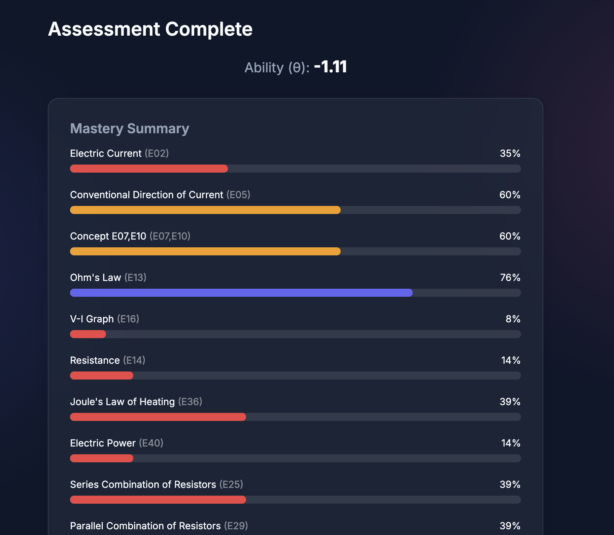
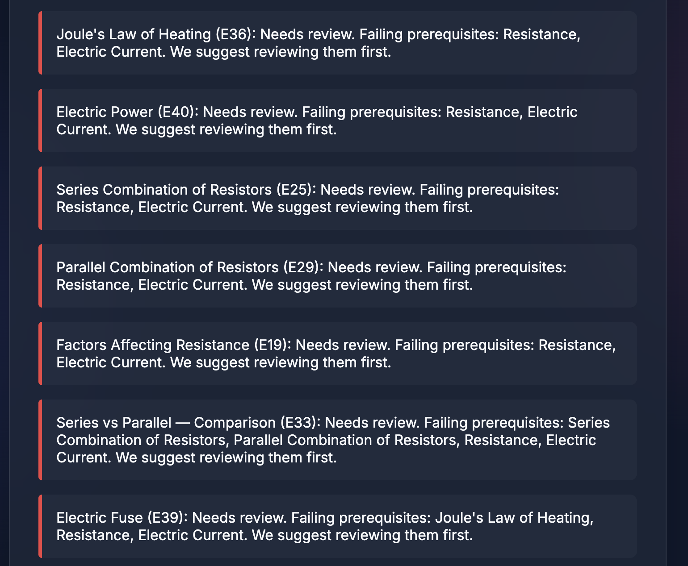
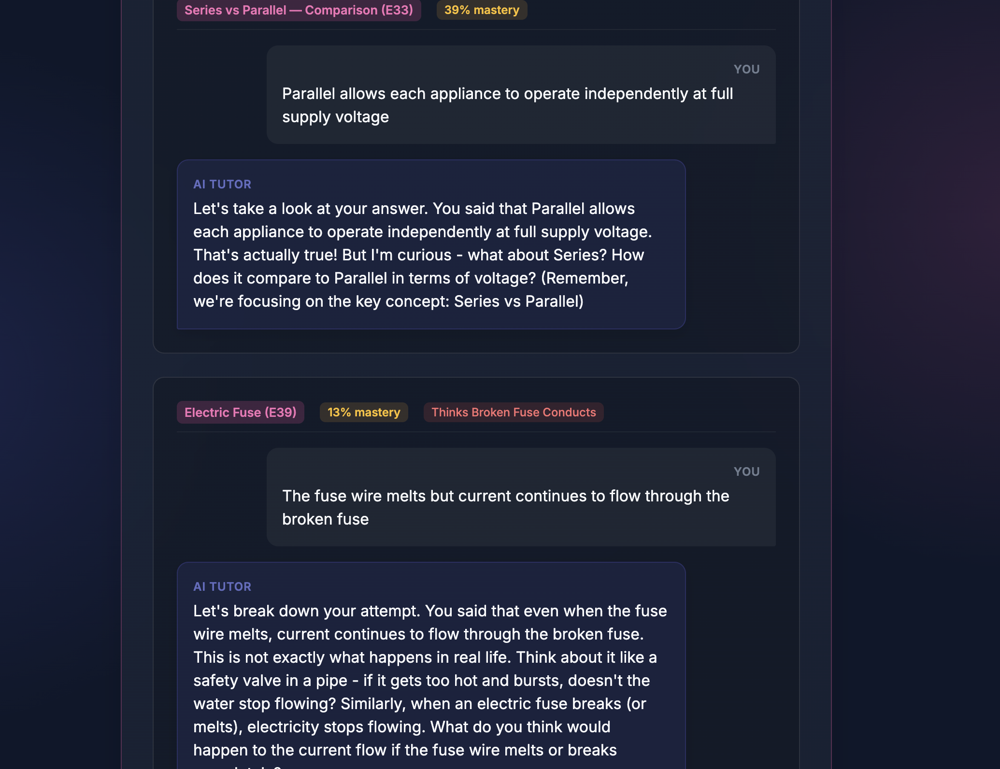
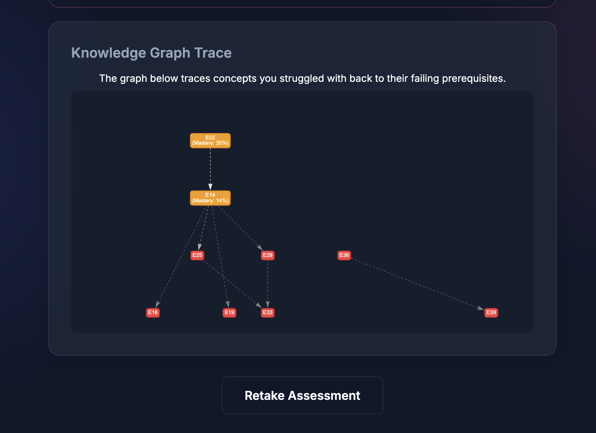

# Synapse: Hybrid IRT + BKT + RAG Adaptive Engine

Synapse is an intelligent, adaptive learning engine that combines **Item Response Theory (IRT)**, **Bayesian Knowledge Tracing (BKT)**, and **Retrieval-Augmented Generation (RAG)**. It dynamically estimates student ability, tracks concept mastery in real-time, and provides highly personalized, Socratic AI tutoring when a student struggles with specific concepts.

---

## 🏗️ Architecture

The system is designed as a set of modular, mathematically pure Python engines, tied together by an integration orchestrator and a web-based Demo UI.

### 1. IRT Engine (`irt-engine/`)
Handles cohort-level psychometric analysis and ability estimation.
- **Feature Builder & Clustering**: Normalizes historical response data and uses K-Means to identify strong/weak student cohorts.
- **Segregation**: Computes Item Discrimination ($a$) and Item Difficulty ($b$) parameters for the question bank.
- **Theta Estimation**: Uses Maximum Likelihood / Expected A Posteriori (EAP) to estimate a student's latent ability ($\theta$).
- **Mastery Initializer**: Bridges IRT and BKT by providing an initial $P(L_0)$ mastery prior based on the student's $\theta$ and diagnostic performance.

### 2. BKT Engine (`bkt-engine/`)
Handles real-time, student-level knowledge tracing during practice phases.
- **State Updates**: Updates the probability of mastery ($P(L_t)$) after every practice question using a Hidden Markov Model.
- **Knowledge Graph Tracker**: Traces failing concepts back to their prerequisites to identify foundational gaps.
- **Demo UI**: A fast, interactive frontend (`demo_ui/`) providing a complete assessment experience, visualizations, and mastery summaries.

### 3. RAG Engine & AI Tutor (`rag-implementation/`)
Delivers grounded, adaptive Socratic interventions.
- **Vector Store**: Uses `sentence-transformers` and `ChromaDB` to chunk and embed textbook content, strictly scoping retrieval to the current concept.
- **AI Tutor**: Powered by **Ollama** (defaulting to `llama3.1:8b`), it acts as a Socratic guide. It is triggered only when a student's BKT mastery drops below a critical threshold ($P(L_t) < 0.85$). 
- **Integration Seam**: The `RAGOrchestrator` wraps the BKT engine, reading $\theta$ and $P(L_t)$ to adapt the AI tutor's vocabulary and depth.

---

## 🚀 Getting Started

### Prerequisites
- **Python 3.9+**
- **Ollama**: Installed and running locally (`http://localhost:11434`).
- An Ollama model (default is `llama3.1:8b`). Pull it using:
  ```bash
  ollama pull llama3.1:8b
  ```

### Setting up the Quiz UI with RAG
1. **Navigate to the BKT Engine directory**
   ```bash
   cd bkt-engine
   ```
2. **Create and activate a virtual environment**
   ```bash
   python -m venv venv
   source venv/bin/activate
   ```
3. **Install dependencies**
   ```bash
   pip install -r requirements.txt
   
   # Since the backend imports from the RAG implementation, install its dependencies too:
   cd ../rag-implementation
   pip install -r requirements.txt
   cd ../bkt-engine
   ```
4. **Ingest the synthetic textbook data into ChromaDB**
   ```bash
   cd ../rag-implementation
   python cli.py --ingest
   cd ../bkt-engine
   ```
5. **Run the Demo UI Backend**
   ```bash
   cd demo_ui
   uvicorn backend:app --reload --port 8080
   ```
6. **Open the UI**
   Navigate to `http://127.0.0.1:8080/` in your browser. Click **"Simulate Struggling Student"** to see the BKT mastery drop, trace the knowledge graph, and watch the AI Tutor intervene!

---

## 📸 UI Screenshots

Here is a glimpse of the Interactive Quiz Engine in action:

**1. Mastery Summary & Diagnostics**


**2. AI Tutor Interventions**


**3. RAG/LLM Socratic Tutoring**


**4. Knowledge Graph Prerequisite Tracing**


---

## 🛠️ CLI Tools

Both the IRT and RAG engines ship with dedicated CLIs for testing and data pipeline execution.

**IRT Engine Pipeline:**
```bash
cd irt-engine
python -m irt --demo --verbose
```

**RAG Engine Testing:**
```bash
cd rag-implementation
# Test the Socratic Tutor for a specific Concept ID
python cli.py --tutor E01
```
